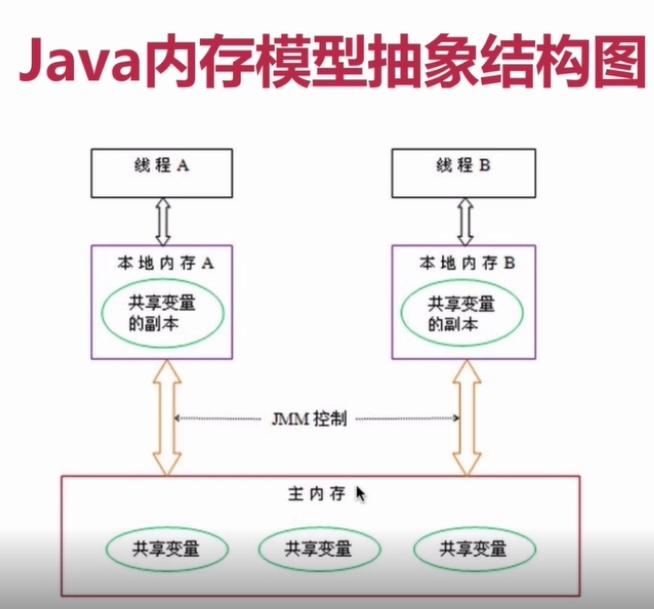

# Java 内存模型

Java的并采用的是共享内存模型，Java线程之间的通信总是隐式进行，整个通信过程对程序员完全透明。

## 1. Java内存模型抽象结构

堆内存：实例域、静态域、数组元素都存储在堆内存中。

栈内存：局部变量、方法定义参数、异常处理参数、返回值引用等都存在栈内存中。

只有堆内存内的对象存在可见性问题。

Java线程之间的通信由Java内存模型（JMM）控制，JMM决定一个线程对共享变量的写入何时对另一个线程可见。线程之间的共享变量存储在主内存（Main Memory）中，每个线程都有一个私有的本地内存（Local Memory），本地内存中存储了该线程 读/写 共享变量的副本。JMM是以抽象的概念，并不真实存在，其只是Java定义了内存模型规范。



从上面上来看，如果线程A于线程B之间要通信的话，必须经历如下两步：

1.线程A把本地内存A中更新过的共享变量刷新到主内存中。

2.线程B到主内存中去读取线程A之前已更新过的共享变量。

JMM通过控制主内存与每个线程的本地内存之间的交互，来为Java程序员提供内存可减性保证。

# 2. happens-before(先行发生)

JSR-133使用happens-before的概念来阐述操作之间的内存可见性。在JMM中，如果一个操作执行的结果需要对另一个操作可见，那么这两个操作之间必须要存在happens-before关系。这里提到的两个操作既可以是在一个线程内，也可以是不同线程之间。

happens-before规则如下：

程序顺序规则：一个线程中的每个操作，happens-before于该线程中的任何后续操作。

监视器锁规则：对一个锁的解锁，happens-before于随后对这个锁的加锁。

volatile变量规则：对一个volatile域的写，happens-before于任意后续对这个volatile域的读。

传递性：如果A happens-before B，且B happens-before C，那么A happens-before C。

注意：两个操作之间happens-before关系，并不意味这前一个操作必须要在后一个操作之前执行。happens-before仅仅要求前一个操作的执行结果，对后一个操作**可见**。

## 3. 重排序

在计算机中，软件技术和硬件计算有一个共同的目标：在不改变程序执行结果的前提下，尽可能提高并行读。Java的JMM使用happens-before同样遵守这个目标。

例如在单线程内，重排序：

```java
double pi = 3.14;
double r = 1.0;
double area = pi * r * r;
```

如果代码如果编译器重排序pi和r的赋值顺序是可以的。

在单线程中，对存在在控制依赖的操作重排序，不会改变执行结果；但在多线程程序中，对存在控制依赖的操作重排序，可能会改变程序的执行结果。因此要引用volatile、synchronized、final来保证线程的执行顺序。


## 4. 未同步程序执行特性

对于为同步的程序，JMM只提供最小安全性：线程执行时读取到的值，要么是之前某个线程写入的值，要么是默认值（0、Null、False）。为了实现最小安全性，JVM在堆上分配对象时，首先会对内存空间进行清零，然后才会在上面分配对象。


