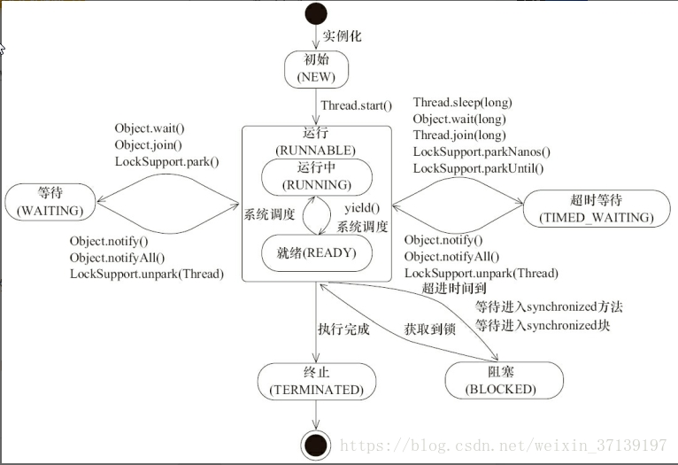

# Thread

## 1 基础

现代操作系统调度的最小单元是线程，也叫轻量级进程（Light Weight Process），在一个进程里可以创建多个线程，这些线程都拥有各自的计算器、堆栈和局部变量属性，并且能够访问共享的内存变量。处理器在这些线程上高速切换，让使用者感觉这些线程在同时执行。

### 1.1 线程的状态

Java线程在运行的生命周期中可能处于以下几种状态：

NEW 初始化状态，线程被构建，但还没有调用start()方法；

RUNNABLE 运行状态，Java线程将操作系统中的就绪和运行两种状态统称为"运行中"；

BLOCKED 阻塞状态，线程阻塞于锁；    例如：线程等待获取锁synchronzied(xxx){}，但现在锁被其它线程占用；

WAITING 等待状态，表示线程进入等待状态，等待其它线程唤醒或中断； 例如：object.wait();

TIME_WAITING 超时等待，区别于WAITING，其可在指定的时间自动返回； 例如：Thread.sleep(xxxx);

TERMINATED 终止状态，表示当前线程已经执行完毕；

我们可以使用jstack工具查看JVM内线程的状态；

### 1.2 线程状态变迁

通过下面的图，我们了解到，不同的方法调用(操作)，可以使线程转化到不同的状态；




### 1.3 守护线程

可以通过Thread.setDaemon(true)线程设置为守护(Daemon)线程；为了区别守护线程，我们把没有设置为Daemon的线程称为普通线程。当前JVM中不存在普通线程的时候，不管当前是否还有守护线程在运行，JVM将会退出。

### 1.4 线程中断

中断可以理解为线程的标示位属性，其它线程对该线程打招呼，其它线程通过调用该线程的interrupt()方法对其进行中断操作。打招呼是你打招呼，至于是否真的中断只能运行的线程自己来决定。

线程通过方法isInterrupted()来进行判断是否该线程已经被其它线程设置为中断。

许多声明抛出InterruptedException的方法（例如 Thread.sleep(long mills)方法）这些方法在抛出InterruptedException之前，Java虚拟机会先将该线程中断标识位清除，然后再抛出InterruptedException，此时调用isInterrupted()返回false。

#### 安全的终止线程

如果要安全的终止线程，最好是通过**标志位+isInterrupted()**判断来安全的退出检查。

```java
private static class Runner implements Runnable {
    private volatile boolean on = true;
    @Override
    public void run(){
        while(this.on && Thread.currentThread().isInterrupted()){
            i++;
        }
    }
    public void cannel(){
        this.on = false;
    }
}


```

这样外部线程既可以通过调用cannel()来设置标志终止线程，也可以使用interrupt()来中断线程。

### 1.5 线程通信

#### 1.5.1 通过使用synchronized和volatile关键字

关键字volatile：可以用来修饰成员变量，就是告知程序任何对该变量的访问均需要从内存中获取，而对的改变也会同步刷新回主内存，它能保证线程对变量的可见性。

关键字synchronzied：可以修饰方法和同步块，它主要确保多个线程在同一个时刻，只能有一个线程处于方法或者同步块中，它保证了线程变量访问的可见性和排他性。

#### 1.5.2 等待(wait)/通知(notify)机制

等待方:

```java
synchronized(对象){
    
    while(条件不满足){
        对象.wait();
    }
    对应的处理逻辑
}
```

通知方：

```java
synchronized(对象){
    改变条件
    对象.notifyAll();    
}
```


## 2.线程使用

### 2.1 ThreadLocal

ThreadLocal线程变量，用于同一个线程不同方法之间的值传递。

#### 使用

实例化：可以声明为静态类变量和对象实例变量，这个无所谓。

```
ThreadLocal<String> testThreadLocal = new ThreadLocal<String>();
```

设置值：

```
testThreadLocal.set("123");
```

取值：

```
testThreadLocal.get("123");
```

但用过后一定要清除（最好放在finally中）：

```
testThreadLocal.remove();
```

#### 原理说明

```
ThreadLocal<T> tl = new ThreadLocal<T>();
```

每个线程(**Thread**)对象内维护了一个**ThreadLocal.ThreadLocalMap threadLocals**属性，其存放上面创建的线程变量实例，这个ThreadLocalMap对象类似于实现了Map，其key为**ThreadLocal对象(例如：上面的tl)**的哈希值，其value为执行set方法的value参数。因此你new了多少个ThreadLocal();就有多少个线程变量，如下示例：

ThreadLocal threadLocal1 = new ThreadLocal();

threadLocal1.set("123");

ThreadLocal threadLocal2 = new ThreadLocal();

threadLocal2.set("456");

ThreadLocal threadLocal3 = new ThreadLocal();

threadLocal1.set("789");

thread--->ThreadLocalMap

 key=threadLocal1对象的哈希值(例如：1)，value="123"

 key=threadLocal2对象的哈希值(例如：2)，value="456"

 key=threadLocal3对象的哈希值(例如：3)，value="789"

threadLocal1.get();还是通过ThreadLocal内的哈希算法，得到当前对象“threadLocal1对象的哈希值(例如：1)”，然后获取对应的值就可以了。

#### 注意

因为当前线程池的大量使用，线程使用后会被复用，因此线程变量(ThreadLocal)使用后，应在线程业务结束的位置，清除的线程变量(threadLocal.remove())，以免错误和内存泄露。

### 2.2 InheritableThreadLocal

前面2.1提到了ThreadLocal是线程变量，其只是当前线程的线程变量，如果当前线程要创建子线程，那么就要使用InheritableThreadLocal把当前线程的线程变量传递到子线程中。

```java
public class Test {

    public static ThreadLocal<Integer> threadLocal = new InheritableThreadLocal<Integer>();

    public static void main(String args[]) {
        threadLocal.set(new Integer(456));
        Thread thread = new MyThread();
        thread.start();
        System.out.println("main = " + threadLocal.get());
    }

    static class MyThread extends Thread {
        @Override
        public void run() {
            System.out.println("MyThread = " + threadLocal.get());
        }
    }
}
```

MyThread线程可以正确的获取到456，而如果你把InheritableThreadLocal修改为ThreadLocal，那么MyThread线程不能获取到线程变量。

### 


