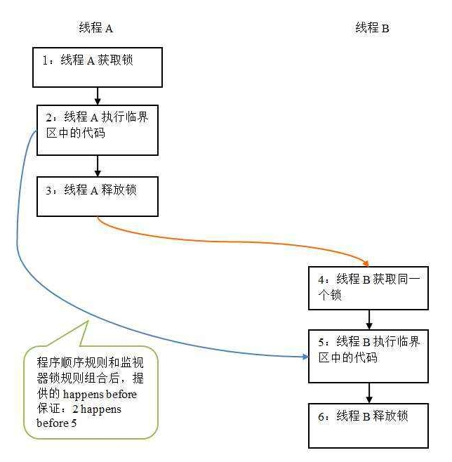
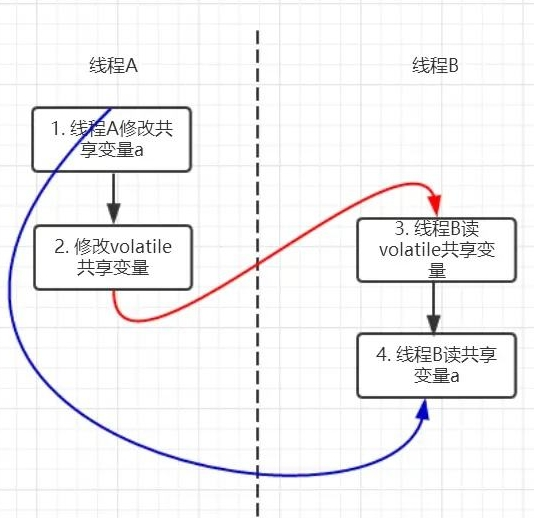
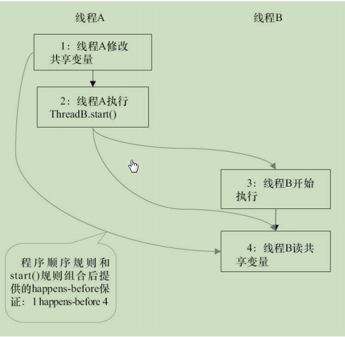
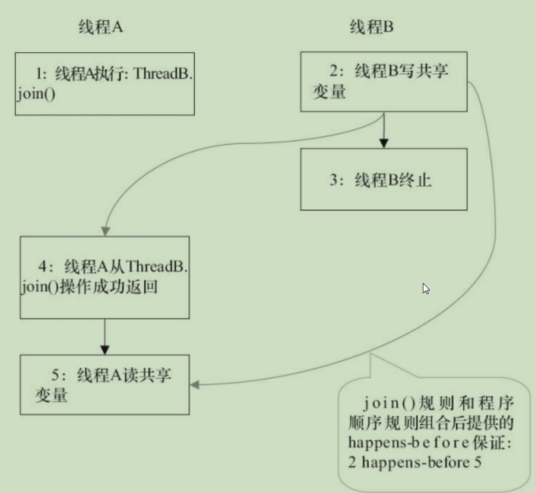

# happens-before(先行发生于)

例如：A happens-before B，那么解释为A先行发生于B，A操作的结果B会马上看到(可见性)。

JSR-133使用happens-before的概念来阐述操作之间的内存可见性。在JMM中，如果一个操作执行的结果需要对另一个操作可见，那么这两个操作之间必须要存在happens-before关系。这里提到的两个操作既可以是在一个线程内，也可以是不同线程之间。

# happens-before规则如下：

**程序顺序规则：一个线程中的每个操作，happens-before于该线程中的任何后续操作。**

**监视器锁(synchronized)规则：对一个锁的解锁，happens-before于随后对这个锁的加锁。**

**volatile变量规则：对一个volatile域的写，happens-before于任意后续对这个volatile域的读。**

**传递性：如果A happens-before B，且B happens-before C，那么A happens-before C。**

**start()规则：如果线程A执行操作ThreadB.start()（启动线程B），那么A线程的ThreadB.start()操作happens-before于线程B的任意操作。**

**join()规则：如果线程A执行操作ThreadB.join()并成功返回，那么线程B中的任意操作happens-before于线程A从ThreadB.join()操作成功返回。**

注意：两个操作之间happens-before关系，并不意味这前一个操作必须要在后一个操作之前执行。happens-before仅仅要求前一个操作的执行结果，对后一个操作**可见**。

### 监视器(synchronized)规则

可以查看"synchronized.md"文章。

### volatile变量规则

可以查看"volatile.md"文章。

### start()规则

通过happens-before规则分析：

1 happens-before 2 是由程序顺序规则产生；

2 happens-before 3 是由start()规程产生；

1 happens-before 4 是由传递性规程产生；

通过上面的happens-before分析，可以证明**线程A执行ThreadB.start()之前对共享变量的所做的修改，接下来线程B开始执行后都将确保对线程B可见。**

#### 解释servlet的线程可见性

**结合上图的线程A和线程B来分析**

tomcat主线程(线程A)初始化Servlet(调用servlet.init()方法)，其可以在init()方法中初始化共享成员变量。当http请求达到，tomcat分配http处理线程(线程B)，http处理线程运行service()方法，可以正确的获取主线程servlet.init()初始化的成员变量。

分析Spring的Controller线程可见性？

tomcat主线程(线程A)启动，调用DispatcherServlet.init()方法初始化了各种spring 单例Bean。当http请求达到，tomcat分配http处理线程(线程B)，调用Dispathcer.service()，其会实例化请求映射对应的Controller，同时Controller可以正确的使用DispatcherServlet.init()初始化的各种spring单例Bean。

### join规则()

通过happens-before规则分析：

2 happens-before 4，由join()规则产生；

4 happens-before 5，由程序顺序规程产生；

2 happens-before 5，由传递性规则产生；

 通过上面的happens-before分析，可以证明**线程A执行操作ThreadB.join()并成功返回后，线程B中的任意操作都将对线程A可见。**

