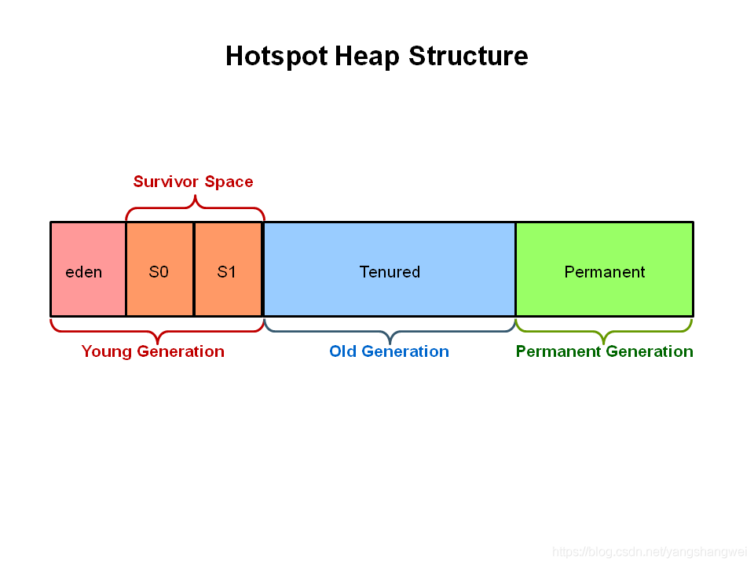

# JVM

## G1

如下好文章出自：https://blog.csdn.net/yangshangwei/article/details/107054854

### GC概述

G1主要针对配备多颗处理器及大容量内存的机器. 尽量满足GC停顿时间要求的同时也具备高吞吐量。

我们知道Serial 、Serial Old 、 Parallel 、 Parallel Old 、 ParNew 、CMS这些垃圾收集器都是基于分代收集理论，即将内存区域按照存储对象的不同分为年轻带、老年代和元空间。如下



G1 和 ZGC 逐渐淡化了这种分代的概念，G1的堆内存分配如下


堆被划分为一组大小相等的堆区域，每个堆区域都有一个连续的虚拟内存范围。 这在内存使用方面提供了更大的灵活性。

------

### G1的内存分区


G1将Java堆内存划分为多个大小相等的独立区域（Region），JVM最多可以有2048个Region。

一般一个Region的大小 = 堆内存/2048 .

举个例子 4096的堆内存，这每个Region的大小为 4096/2048 = 2M .

设置堆内存的时候，适用G1, 务必为2048的倍数。

可以通过参数`-XX:G1HeapRegionSize`调整每个Region的大小，但不建议修改。

**G1在淡化分代理论上还不是很彻底， G1保留了年轻代和老年代的概念，但不再是物理隔阂了，它们是（可以不连续）Region的集合。**

G1中默认年轻代对堆内存的占比是5% , 可以通过`-XX:G1NewSizePercent`设置新生代初始占比

在系统运行中，JVM会不停的给年轻代增加更多的Region，但是最多新生代的占比不会超过60%,可以通过`-XX:G1MaxNewSizePercent`调整

年轻代中的Eden和Survivor对应的region也跟之前一样，默认8:1:1. 意思就是假设年轻代现在有100个region，eden区对应80个，s0对应10个，s1对应10个。

一个Region可能之前是年轻代，如果Region进行了垃圾回收，之后可能又会变成老年代，也就是说Region的区域功能可能会动态变化。

------

G1中 对象什么时候会转移到老年代 ？

原则 跟之前讲过的一样，唯一不同的是**对大对象的处理**

G1有专门分配大对象的Region叫Humongous区，而不是让大对象直接进入老年代的Region中。

在G1中，**大对象的判定规则就是一个大对象超过了一个Region大小的50% 。**

举个例子比如按照上面算的，每个Region是2M，只要一个大对象超过了1M，就会被放入Humongous中，而且一个大对象如果太大，可能会横跨多个Region来存放。Humongous区专门存放短期巨型对象，不用直接进老年代，可以节约老年代的空间，避免因为老年代空间不够的GC开销。

Full GC的时候除了收集年轻代和老年代之外，也会将Humongous区一并回收。

------

### G1回收垃圾的几个阶段


#### 初始标记 （initial mark，STW）

STW ：暂停所有的其他线程，并记录下gc roots直接能引用的对象，速度很快

#### 并发标记（Concurrent Marking）

同CMS的并发标记

#### 最终标记（Remark，STW）

同CMS的重新标记

#### 筛选回收（Cleanup，STW）

首先对各个Region的回收价值和成本进行排序，**根据用户所期望的GC停顿STW时间(可以用JVM参数 `-XX:MaxGCPauseMillis`指定)来制定回收计划** 。

举个例子 老年代此时有1000个Region都满了，但是因为根据预期停顿时间，本次垃圾回收可能只能停顿200ms，那么通过之前回收成本计算得知，可能回收其中800个Region刚好需要200ms，那么就只会回收800个Region(**Collection Set**，要回收的集合)，尽**量把GC导致的停顿时间控制在我们指定的范围内**。

这个阶段 G1因为内部实现太复杂暂时没实现并发回收。到了ZGC，Shenandoah就实现了并发收集，Shenandoah可以看成是G1的升级版本。

不管是年轻代或是老年代，回收算法主要用的是**复制算法**，将一个region中的存活对象复制到另一个region中， **G1采用复制算法回收几乎不会有太多内存碎片。**

------

G1收集器在后台维护了一个优先列表，每次根据允许的收集时间，优先选择回收价值最大的Region(这也就是它的名字Garbage-First的由来) 。

比如一个Region花200ms能回收10M垃圾，另外一个Region花50ms能回收20M垃圾，在回收时间有限情况下，G1当然会优先选择后面这个Region回收。

这种使用Region划分内存空间以及有优先级的区域回收方式，保证了G1收集器在有限时间内可以尽可能高的收集效率。

------

### G1的特征

- 并行与并发：G1能充分利用CPU、多核环境下的硬件优势，使用多个CPU（CPU或者CPU核心）来缩短Stop-The-World停顿时间。部分其他收集器原本需要停顿Java线程来执行GC动作，G1收集器仍然可以通过并发的方式让java程序继续执行。
- 分代收集：虽然G1可以不需要其他收集器配合就能独立管理整个GC堆，但是还是保留了分代的概念。
- 空间整合：与CMS的“标记–清理”算法不同，G1从整体来看是基于“标记-整理”算法实现的收集器；从局部上来看是基于“复制”算法实现的。
- 可预测的停顿：这是G1相对于CMS的另一个大优势，降低停顿时间是G1 和 CMS 共同的关注点，但G1 除了追求低停顿外，还能建立可预测的停顿时间模型，能让使用者明确指定在一个长度为M毫秒的时间片段(通过参数 `-XX:MaxGCPauseMillis` 指定)内完成垃圾收集。

G1默认的停顿目标为两百毫秒 .

一般来说， 回收阶段占到几十到一百甚至接近两百毫秒都很正常， 但如果我们把停顿时间调得非常低， 譬如设置为二十毫秒， 很可能出现的结果就是由于停顿目标时间太短， 导致每次选出来的回收集只占堆内存很小的一部分， 收集器收集的速度逐渐跟不上分配器分配的速度， 导致垃圾慢慢堆积。

很可能一开始收集器还能从空闲的堆内存中获得一些喘息的时间， 但应用运行时间一长就不行了， 最终占满堆引发Full GC反而降低性能， 所以通常把期望停顿时间设置为一两百毫秒或者两三百毫秒会是比较合理的。

------

### G1垃圾收集分类

#### YoungGC

YoungGC并不是说现有的Eden区放满了就会马上触发，G1会计算下现在Eden区回收大概要多久时间，如果回收时间远远小于参数 `-XX:MaxGCPauseMills` 设定的值，那么增加年轻代的region，继续给新对象存放，不会马上做Young GC，直到下一次Eden区放满，G1计算回收时间接近参数 `-XX:MaxGCPauseMills` 设定的值，那么就会触发Young GC

------

#### MixedGC

不是FullGC，老年代的堆占有率达到参数(`-XX:InitiatingHeapOccupancyPercent`)设定的值则触发，回收所有的Young和部分Old(根据期望的GC停顿时间确定old区垃圾收集的优先顺序)以及大对象区，正常情况G1的垃圾收集是先做MixedGC，主要使用复制算法，需要把各个region中存活的对象拷贝到别的region里去，拷贝过程中如果发现没有足够的空region能够承载拷贝对象就会触发一次Full GC

------

#### Full GC

停止系统程序，然后采用单线程进行标记、清理和压缩整理，好空闲出来一批Region来供下一次MixedGC使用，这个过程是非常耗时的。(Shenandoah优化成多线程收集了)

------

### G1收集器参数

- `-XX:+UseG1GC`:使用G1收集器
- -`XX:ParallelGCThreads`:指定GC工作的线程数量
- `-XX:G1HeapRegionSize`:指定分区大小(1MB~32MB，且必须是2的N次幂)，默认将整堆划分为2048个分区
- `-XX:MaxGCPauseMillis`:目标暂停时间(默认200ms)
- `-XX:G1NewSizePercent`:新生代内存初始空间(默认整堆5%，值配置整数，默认就是百分比)
- `-XX:G1MaxNewSizePercent`:新生代内存最大空间
- `-XX:TargetSurvivorRatio`:Survivor区的填充容量(默认50%)，Survivor区域里的一批对象(年龄1+年龄2+年龄n的多个年龄对象)总和超过了Survivor区域的50%，此时就会把年龄n(含)以上的对象都放入老年代
- `-XX:MaxTenuringThreshold`:最大年龄阈值(默认15)
- `-XX:InitiatingHeapOccupancyPercent`:老年代占用空间达到整堆内存阈值(默认45%)，则执行新生代和老年代的混合收集(MixedGC)，比如我们之前说的堆默认有2048个region，如果有接近1000个region都是老年代的region，则可能就要触发MixedGC了
- `-XX:G1MixedGCLiveThresholdPercent`(默认85%) region中的存活对象低于这个值时才会回收该region，如果超过这个值，存活对象过多，回收的的意义不大。
- `-XX:G1MixedGCCountTarget`:在一次回收过程中指定做几次筛选回收(默认8次)，在最后一个筛选回收阶段可以回收一会，然后暂停回收，恢复系统运行，一会再开始回收，这样可以让系统不至于单次停顿时间过长。
- `-XX:G1HeapWastePercent`(默认5%): gc过程中空出来的region是否充足阈值，在混合回收的时候，对Region回收都是基于复制算法进行的，都是把要回收的Region里的存活对象放入其他Region，然后这个Region中的垃圾对象全部清理掉，这样的话在回收过程就会不断空出来新的Region，一旦空闲出来的Region数量达到了堆内存的5%，此时就会立即停止混合回收，意味着本次混合回收就结束了。

------

### 适用场景

- 50%以上的堆被存活对象占用
- 对象分配和晋升的速度变化非常大
- 垃圾回收时间特别长，超过1秒
- 8GB以上的堆内存(建议值)
- 停顿时间是500ms以内

------

### G1优化建议

假设参数 `-XX:MaxGCPauseMills` 设置的值很大，导致系统运行很久，年轻代可能都占用了堆内存的60%了，此时才触发年轻代gc。

那么存活下来的对象可能就会很多，此时就会导致Survivor区域放不下那么多的对象，就会进入老年代中。或者是你年轻代gc过后，存活下来的对象过多，导致进入Survivor区域后触发了动态年龄判定规则，达到了Survivor区域的50%，也会快速导致一些对象进入老年代中。

所以这里核心还是在于调节 `-XX:MaxGCPauseMills` 这个参数的值，在保证他的年轻代gc别太频繁的同时，还得考虑每次gc过后的存活对象有多少,避免存活对象太多快速进入老年代，频繁触发mixed gc.

------

### 优化小Demo

像kafka来这种支撑高并发的消息系统来说说，每秒处理几万甚至几十万消息时很正常的，一般来说部署kafka需要用大内存机器(比如64G)，也就是说可以给年轻代分配个三四十G的内存用来支撑高并发处理 。

这里就涉及到一个问题了，我们以前常说的对于eden区的young gc是很快的，这种情况下它的执行还会很快吗？很显然，不可能，因为内存太大，处理还是要花不少时间的，假设三四十G内存回收可能最快也要几秒钟，按kafka这个并发量放满三四十G的eden区可能也就一两分钟吧，那么意味着整个系统每运行一两分钟就会因为young gc卡顿几秒钟没法处理新消息，显然是不行的。

那么对于这种情况如何优化了，我们可以使用G1收集器，设置 `-XX:MaxGCPauseMills` 为50ms，假设50ms能够回收三到四个G内存，然后50ms的卡顿其实完全能够接受，用户几乎无感知，那么整个系统就可以在卡顿几乎无感知的情况下一边处理业务一边收集垃圾。

G1天生就适合这种大内存机器的JVM运行，可以比较完美的解决大内存垃圾回收时间过长的问题。

## TLAB

> ##### new对象与指针碰撞

new对象怎么就出问题了呢？
 java中我们要创建一个对象,用关键字new就可以了。但是，在我们日常中，有很多生命周期很短的对象。比如：


```cpp
public void dome(){
    User user=new user();
    user.sayhi();
}
```

这种对象的作用域都不会逃逸出方法外，也就是说该对象的生命周期会随着方法的调用开始而开始，方法的调用结束而结束。
 假设JVM所有的对象都放在堆内存中(为什么用假设，因为JVM并不是这样)一旦方法结束，没有了指向该对象的引用，该对象就需要被GC回收，如果存在很多这样的情况，对GC来说压力山大呀。

那么什么又是指针碰撞呢？
 假设JVM虚拟机上，堆内存都是规整的。堆内存被一个指针一分为二。指针的左边都被塞满了对象，指针的右变是未使用的区域。每一次有新的对象创建，指针就会向右移动一个对象size的距离。这就被称为指针碰撞。


图1.png

好，问题来了。如果我们用多线程执行刚才的dome方法，一个线程正在给A对象分配内存，指针还没有来的及修改，同时为B对象分配内存的线程，仍引用这之前的指针指向。这样就出现毛病了。
 (要注意的是，上面两种情况解决方案不止一个，我今天主要是讲TLAB，其他方案自行查询)

> ##### TLAB的出现

我们现在已经搞清楚，我们出现了哪些问题。我在为大家介绍一下今天的主角。

TLAB的全称是Thread Local Allocation Buffer，即线程本地分配缓存区，这是一个线程专用的内存分配区域。

如果设置了虚拟机参数 -XX:UseTLAB，在线程初始化时，同时也会申请一块指定大小的内存，只给当前线程使用，这样每个线程都单独拥有一个空间，如果需要分配内存，就在自己的空间上分配，这样就不存在竞争的情况，可以大大提升分配效率。

TLAB空间的内存非常小，缺省情况下仅占有整个Eden空间的1%，也可以通过选项-XX:TLABWasteTargetPercent设置TLAB空间所占用Eden空间的百分比大小。

TLAB的本质其实是三个指针管理的区域：start，top 和 end，每个线程都会从Eden分配一块空间，例如说100KB，作为自己的TLAB，其中 start 和 end 是占位用的，标识出 eden 里被这个 TLAB 所管理的区域，卡住eden里的一块空间不让其它线程来这里分配。

**TLAB只是让每个线程有私有的分配指针，但底下存对象的内存空间还是给所有线程访问的，只是其它线程无法在这个区域分配而已。从这一点看，它被翻译为线程私有分配区更为合理一点**
 **当一个TLAB用满（分配指针top撞上分配极限end了），就新申请一个TLAB，而在老TLAB里的对象还留在原地什么都不用管——它们无法感知自己是否是曾经从TLAB分配出来的(也没这个必要)，而只关心自己是在eden里分配的。**

> ##### TLAB的缺点

事务总不是完美的，TLAB也又自己的缺点。因为TLAB通常很小，所以放不下大对象。
 1，TLAB空间大小是固定的，但是这时候一个大对象，我TLAB剩余的空间已经容不下它了。(比如100kb的TLAB，来了个110KB的对象)
 2，TLAB空间还剩一点点没有用到，有点舍不得。(比如100kb的TLAB，装了80KB，又来了个30KB的对象)
 所以JVM开发人员做了以下处理，设置了最大浪费空间。
 当剩余的空间小于最大浪费空间，那该TLAB属于的线程在重新向Eden区申请一个TLAB空间。进行对象创建，还是空间不够，那你这个对象太大了，去Eden区直接创建吧！
 当剩余的空间大于最大浪费空间，那这个大对象请你直接去Eden区创建，我TLAB放不下没有使用完的空间。

当然，又回造成新的病垢。
 3，Eden空间够的时候，你再次申请TLAB没问题，我不够了，Heap的Eden区要开始GC，
 4，TLAB允许浪费空间，导致Eden区空间不连续，积少成多。以后还要人帮忙打理。


